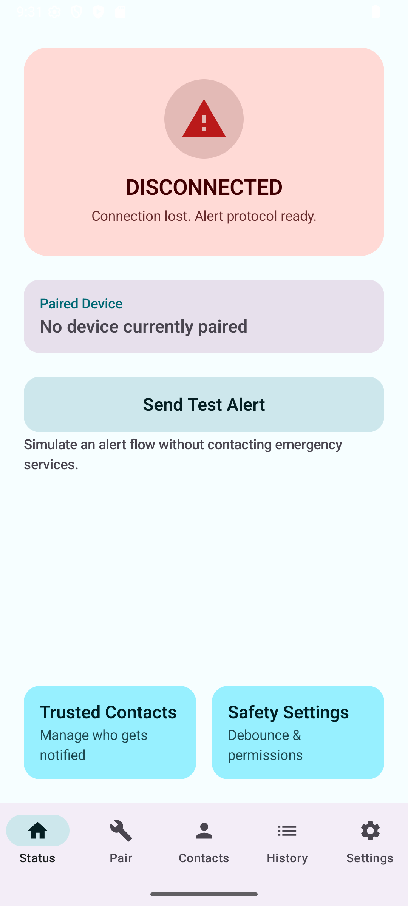
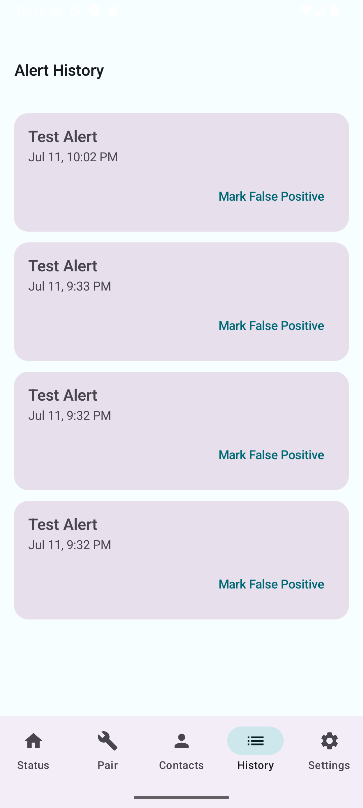

<p align="center">
  
</p>

<h1 align="center">Tether</h1>

<p align="center">
  An Android app that silently alerts a trusted contact if your phone is suddenly separated from a paired device, for example if it is snatched during a commute.
</p>

---

## Why this exists

Built around a real commute, Rea Vaya, Gautrain, and Gaubus, daily, in Johannesburg. Phone or bag snatching during a commute is a real risk. Most personal safety apps require you to open the app and press a button during an incident, which is not realistic when something happens fast. Tether removes that step: a small BLE tag (or a second cheap phone) stays paired to your primary phone, and a sudden, ungraceful disconnect triggers a silent SMS alert with your last known location to a trusted contact.

## How it works

1. Pair a BLE device (a tag or a second phone acting as a beacon).
2. A foreground service holds the GATT connection and polls RSSI every 2 seconds.
3. On disconnect, a rule-based classifier looks at the RSSI trend: a signal that was already fading is a gradual drop (elevators, tunnels, walking out of range), a signal that was strong and then instantly gone is an abrupt drop, the kind that matters.
4. A debounce window runs (default 15s for abrupt, 45s for gradual, user tunable) while reconnect attempts happen. If the device comes back, the alert is cancelled.
5. A confirmed disconnect fetches the last known location and sends a direct SMS (with a maps link) to every trusted contact. No backend, no data connection needed, which matters in exactly the moments this app exists for.
6. Every alert is logged locally and can be marked as a false positive afterwards to feed future tuning.

The disconnect logic is intentionally rule-based and explainable in one sentence, no ML. See [docs/ARCHITECTURE.md](docs/ARCHITECTURE.md) for the full design.
## Video demo

https://github.com/user-attachments/assets/d05e0409-dfc8-4865-b244-5e53a973a43b

## Screenshots

| Home | Alert history |
|---|---|
|  |  |

## Try it live

Runs the actual APK in a real Android emulator, right in your browser, no install: [appetize.io/app/b_dvuwlumpp3kkxwzgtplclbaciu](https://appetize.io/app/b_dvuwlumpp3kkxwzgtplclbaciu)

## Demo

A 30 second walkthrough (Home status, pairing scan, trusted contacts, alert history detail, settings, and a live test alert): [▶ docs/assets/demo.mp4](docs/assets/demo.mp4)

## Tech stack

| Layer | Choice |
|---|---|
| Language / UI | Kotlin, Jetpack Compose, Material 3 |
| BLE | Native `BluetoothLeScanner` + GATT, no third-party BLE library |
| Background | Foreground service (`connectedDevice` type) |
| Location | `FusedLocationProviderClient`, last known location only |
| Alerting | `SmsManager` direct send, zero-backend |
| Storage | Room (contacts, paired device, alert history) |

## Building

Requirements: JDK 17+ (the project pins Android Studio's bundled JDK in `gradle.properties`, adjust `org.gradle.java.home` or remove it to use your own) and the Android SDK (platform 35). Create a `local.properties` with your `sdk.dir`.

```
./gradlew assembleDebug
```

The APK lands in `app/build/outputs/apk/debug/`. Unit tests for the disconnect classifier:

```
./gradlew testDebugUnitTest
```

## Project structure

```
app/src/main/java/com/example/tether/
  ble/         scanning, GATT connection, RSSI monitoring
  alerting/    disconnect classifier, debounce monitor, SMS, alert pipeline
  data/        Room entities, DAOs, repository, settings
  location/    FusedLocationProviderClient wrapper
  service/     the foreground service tying BLE + alerting together
  ui/          Compose screens (see docs/UI_POLISH_NOTES.md for the motion pass)
```

## Out of scope for v1

Multi-device sync, cloud backend, ML-based anomaly detection, and the offline BLE mesh idea (a separate, later project).

---

Built by [Nqobile Sibiya](https://github.com/nqobile-x).
