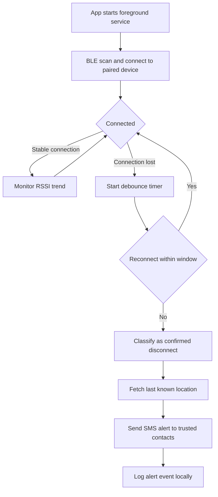

# Architecture: Tether

## Context and goals

Tether watches a BLE connection between a primary phone and a paired device (a dedicated tag or a second phone). The goal is to tell the difference between a normal, boring signal drop and a sudden, violent one, and only alert a trusted contact in the second case. False alarms need to be rare, or the feature gets ignored. Missed real events defeat the purpose entirely. That trade-off is the whole design problem.

## High-level flow

## The debounce problem, in plain terms

A connection can drop for two very different reasons:

1. **Boring reasons.** Going underground on the Gautrain, stepping into a lift, walking into a crowded taxi where bodies block the signal, walking briefly out of BLE range (roughly 10 meters, varies with obstacles).
2. **The reason that matters.** Someone grabs the phone or the bag and moves away from the tag fast.

The signal to tell these apart isn't just "connected or not," it's the *shape* of how the connection degrades.

**Rule-based heuristic for v1:**

- A slow RSSI decline over several seconds before disconnect, phone walking naturally out of range, environmental interference, is treated as low-priority. Wait the full debounce window before alerting.
- An abrupt disconnect with no preceding RSSI decline, connection was strong, then instantly gone, is treated as high-priority. Shorter debounce window.
- Either way, before sending an alert, attempt a quick reconnect. If it succeeds within the debounce window, cancel the alert entirely.
- Debounce windows should be user-configurable in Settings (a sensible default: 15 seconds for the high-priority path, 45 seconds for the low-priority path), since environments vary a lot (a crowded taxi behaves differently than a quiet street).

This is intentionally simple and explainable. It won't be perfect. That's fine for v1, the goal is a defensible, understandable first version, not a research paper. Document false positive/negative observations during testing so v2 has real data to improve on.

## Data model

**PairedDevice**
- `deviceAddress: String`
- `deviceName: String`
- `pairedAt: Timestamp`
- `lastKnownRssi: Int`

**TrustedContact**
- `id: Long`
- `name: String`
- `phoneNumber: String`
- `isPrimary: Boolean`

**AlertEvent**
- `id: Long`
- `timestamp: Timestamp`
- `classification: String` (e.g. "abrupt_disconnect", "manual_test")
- `latitude: Double?`
- `longitude: Double?`
- `contactsNotified: List<Long>`
- `wasFalsePositive: Boolean?` (user can mark this after the fact, feeds future tuning)

## Key decisions and trade-offs

**Direct SMS instead of a backend.** The entire point of this app is working in exactly the moment when things go wrong, which is often also the moment when data connectivity is unreliable (crowded taxi rank, underground). SMS works without a data connection. A backend adds a single point of failure exactly where reliability matters most. Revisit this only if a future version needs richer alerting (push notifications to a companion app, live location sharing).

**Foreground service, not WorkManager.** BLE connection monitoring needs to be near-continuous, not periodic. WorkManager is built for deferred, batched work, wrong tool here. A foreground service with a persistent notification is the correct, honest approach, the user should always know the app is actively watching.

**Rule-based debounce, not ML.** Explainable and debuggable beats clever. This also matters for an interview narrative, being able to describe exactly why an alert did or didn't fire is a real strength, not a limitation.

## Security considerations

- Trusted contact phone numbers and alert history are local-only (Room) in v1, no cloud sync, no third-party server sees this data.
- BLE pairing should use a bonded connection where the platform supports it, not just an open GATT connection, to reduce the chance of a third party spoofing the paired device.
- Permission rationale strings must be clear and specific, this app requests background location and BLE permissions, both sensitive, and users should understand exactly why before the system dialog appears.

## Open questions / roadmap

- Should the debounce window auto-adjust based on the user's typical commute pattern over time, versus staying a fixed, manual setting?
- Hardware tag vs. second phone as the paired device, cost and battery trade-offs need real-world testing.
- A v2 could add the offline BLE mesh relay concept as a separate, more ambitious project, out of scope here.
